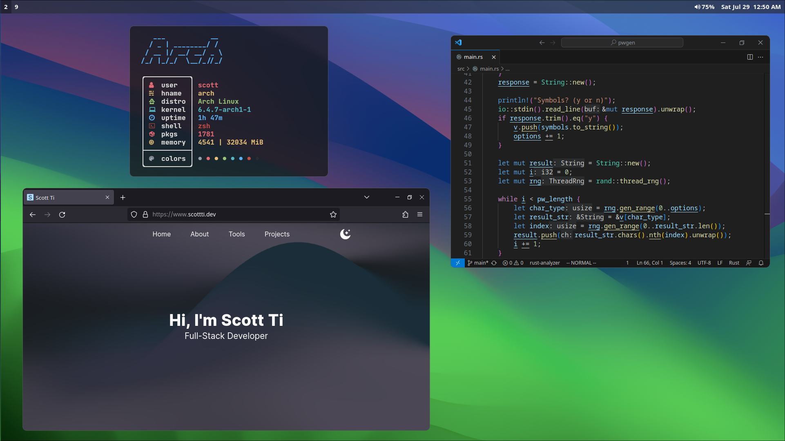

# My dots
Here is my mostly basic configuration. I use kitty as my main terminal and alacritty as backup.

# Screenshot
## Programs seen in screenshot
 - kitty terminal
 - neofetch
 - ranger file explorer
 - astro vim

# Programs
[bspwm window manager](https://github.com/baskerville/bspwm)

[sxhkd hotkey daemon](https://github.com/baskerville/sxhkd)

[kitty terminal](https://github.com/kovidgoyal/kitty)

[alacritty terminal](https://github.com/alacritty/alacritty)

[picom compositor](https://github.com/yshui/picom)

[polybar status bar](https://github.com/polybar/polybar)